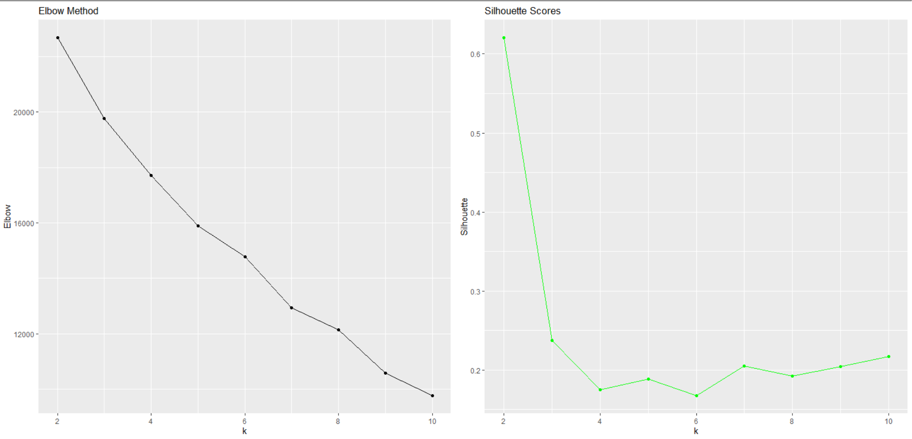
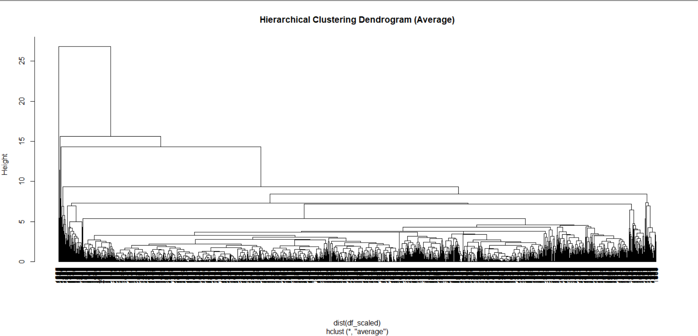
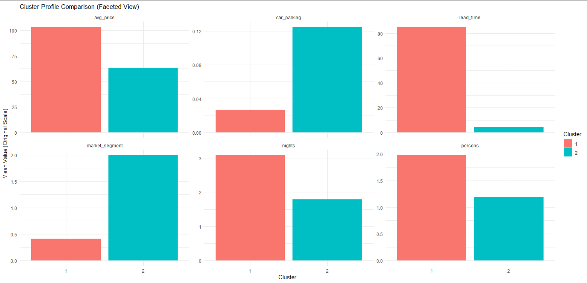

# Cluster Analysis σε Δεδομένα Κρατήσεων Ξενοδοχείου

## Παρουσίαση Εργασίας 1

### 1. Εισαγωγή

Σκοπός της παρούσας εργασίας είναι η ανάλυση δεδομένων κρατήσεων ξενοδοχείου με στόχο τον εντοπισμό clusters. Μέσω της ομαδοποίησης, αναδεικνύονται πρότυπα συμπεριφοράς πελατών, τα οποία μπορούν να αξιοποιηθούν για την πρόβλεψη και ερμηνεία ακυρώσεων, καθώς και για τον σχεδιασμό στοχευμένων επιχειρησιακών στρατηγικών.

Το dataset περιλαμβάνει μεταβλητές όπως αριθμό ατόμων, διάρκεια διαμονής, τιμή κράτησης, ειδικά αιτήματα, χρήση parking, τύπο αγοράς και κατάσταση κράτησης (Ακυρώθηκε ή Όχι).

---

### 2. Προετοιμασία & Επεξεργασία Δεδομένων

Πριν την εφαρμογή αλγορίθμων μηχανικής μάθησης, πραγματοποιήθηκε προετοιμασία των δεδομένων:

1.  **Δημιουργία Νέων Μεταβλητών**:
    - `persons`: Άθροισμα ενηλίκων και παιδιών.
    - `nights`: Άθροισμα διανυκτερεύσεων Σαββατοκύριακου και καθημερινών.
      Ο λόγος για τον οποίο έγιναν αυτή η προετοιμασία είναι ότι αντικατοπρίζουμε την ίδια πληροφορία με λιγότερες μεταβλητές.
2.  Αφαίρεση Περιττών Στηλών:**  
    Αφαιρέθηκαν στήλες που είτε **δεν συμβάλλουν ουσιαστικά στην ομαδοποίηση**, είτε **αντικαταστάθηκαν από πιο αντιπροσωπευτικές μεταβλητές** (π.χ. `Booking_ID`, `date.of.reservation`, `room.type`).  
    Επιπλέον, μέσω διερευνητικής ανάλυσης, χαρακτηριστικά όπως τα `special.requests` και `repeated` εμφάνισαν **χαμηλή διακύμανση και περιορισμένη ερμηνευτική ικανότητα**, χωρίς να ενισχύουν ουσιαστικά τον διαχωρισμό των clusters — σε ορισμένες περιπτώσεις μάλιστα **επιβάρυναν το μοντέλο και μείωσαν τον διαχωρισμό των ομάδων**.  
    Παράλληλα, στήλες όπως `type.of.meal` ή `room.type` δεν θεωρήθηκαν κατάλληλες, καθώς **δεν αποτυπώνουν τη συμπεριφορά του πελάτη**, αλλά κυρίως λειτουργικές επιλογές του ξενοδοχείου, και δεν συμβάλλουν στη δημιουργία διακριτών προφίλ κρατήσεων.  
    Τέλος, η τελική επιλογή των μεταβλητών πραγματοποιήθηκε **με εξαντλητική και χειροκίνητη αξιολόγηση (exhaustive & manual feature selection)**, κρατώντας τον συνδυασμό που παρείχε **τη μέγιστη τιμή Silhouette Score\*\*, δηλαδή τον πιο σαφή και στατιστικά

3.  **Κωδικοποίηση (Encoding)**: Η κατηγορική μεταβλητή `market.segment.type` μετατράπηκε σε αριθμητική (Online=0, Offline=1, Corporate=2, κλπ.).
4.  **Κλιμάκωση (Scaling)**: Στην εργασία εφαρμόστηκε custom scaler και όχι η έτοιμη συνάρτηση scale(), επειδή η συγκεκριμένη συνάρτηση υπολογίζει την τυπική απόκλιση διαιρώντας με το n (population standard deviation) και όχι με βάση τον sample τύπο. Αυτή η διαφορά στην τυποποίηση επηρεάζει τις αποστάσεις μεταξύ των παρατηρήσεων και, κατά συνέπεια, τη διαδικασία ομαδοποίησης. Με τη χρήση της built-in scale() προέκυψαν έξι clusters, ενώ με τον custom scaler σχηματίστηκαν δύο clusters με πιο καθαρό και ερμηνεύσιμο διαχωρισμό. Έτσι, επιλέχθηκε ο custom scaler, καθώς παρείχε πιο σταθερή και ουσιαστική δομή στις ομάδες.

```python
standard_scale <- function(x) {
  (x - mean(x)) / sqrt(mean((x - mean(x))^2))
}
```

### 3. Μεθοδολογία εύρεσης k

Η συνάρτηση elbow_silhouette_analysis() έχει ως στόχο να εντοπίσει τον βέλτιστο αριθμό από cluster k πριν εφαρμοστεί οποιοσδήποτε αλγόριθμος ομαδοποίησης.
Για κάθε πιθανή τιμή του k (από 2 έως 10), εκτελείται η ομαδοποίηση και υπολογίζονται δύο δείκτες ποιότητας:

(α) Μέθοδος Elbow:
Στο πρώτο διάγραμμα απεικονίζεται η συνολική µεταβλητότητα µέσα στις οµάδες (WSS) για διαφορετικές τιµές του k. Η συνολική µεταβλητότητα µέσα στις οµάδες εκφράζει πόσο συµπαγείς είναι οι οµάδες, δηλαδή πόσο κοντά βρίσκονται οι παρατηρήσεις στα κέντρα τους.Καθώς αυξάνεται το k, το WSS μειώνεται, επειδή οι παρατηρήσεις κατανέμονται σε περισσότερες και πιο συμπαγείς οµάδες. Όµως, µετά από ένα σηµείο, η μείωση της WSS γίνεται μικρή και όχι ουσιαστική.
Αυτό το σημείο αλλαγής στην καμπύλη ονομάζεται elbow και υποδεικνύει τον καταλληλότερο αριθμό οµάδων.

(β) Silhouette Method: Στο δεύτερο διάγραμμα παρουσιάζεται ο Silhouette Score για κάθε πιθανή τιμή του
k. Ο δείκτης αυτός μετρά το πόσο καλά διαχωρισμένες είναι τα clusters μεταξύ τους, δηλαδή αν οι παρατηρήσεις ταιριάζουν περισσότερο στην ομάδα όπου ανήκουν παρά σε κάποια άλλη. Υψηλότερες τιμές του Silhouette Score υποδηλώνουν καλύτερο και πιο ξεκάθαρο διαχωρισμό μεταξύ των ομάδων. Ο αριθμός των clusters που αντιστοιχεί στη μέγιστη τιμή του Silhouette Score θεωρείται στατιστικά ο πιο κατάλληλος για την ομαδοποίηση.



Και στις δυο περιπτώσεις, η επιλογή του $k=2$ θεωρείται στατιστικά ο πιο κατάλληλος για την ομαδοποίηση.
Όπως είναι λογικό, αυτή η τιμή του $κ$ θα χρησιμοποιηθεί στην εφαρμογή του K-Means και Hierarchical Clustering.

---

### 3. Μεθοδολογία Clustering

#### K-Means Clustering

Ο αλγόριθμος **K-Means** είναι μέθοδος διαμερισμού (partitioning method) που χωρίζει τις παρατηρήσεις σε k ομάδες, ελαχιστοποιώντας τη **συνολική μεταβλητότητα μέσα στις ομάδες**.
Ξεκινά με τυχαία κέντρα (centroids) και επανατοποθετεί τις παρατηρήσεις με βάση την **Ευκλείδεια απόσταση**, έως ότου τα κέντρα σταθεροποιηθούν.  
Η μέθοδος είναι απλή στην υλοποίηση και την κατανόσησ και κατάλληλη όταν θέλουμε **σαφώς διαχωρισμένα clusters και γρήγορα αποτελέσματα**.

---

#### Hierarchical Clustering με Average Linkage

Η ιεραρχική ομαδοποίηση δημιουργεί ομάδες σταδιακά, **χωρίς να ορίζουμε εξαρχής τον αριθμό των clusters**.  
Με το **Average Linkage**, η συγχώνευση ομάδων γίνεται με βάση τη **μέση απόσταση μεταξύ όλων των ζευγών παρατηρήσεων** από τα δύο clusters.  
Το αποτέλεσμα παρουσιάζεται μέσω ενός **δενδρογράμματος (dendrogram)**, όπου το ύψος (height) κάθε συγχώνευσης δείχνει το πόσο "μακριά" είναι οι ομάδες μεταξύ τους, καθλως και σε ποιο ύψος συγχωνεύονται οι ομάδες.

Στο παρακάτω dendrogram φαίνεται η ιεραρχική συγχώνευση των παρατηρήσεων, όπου όσο αυξάνεται το ύψος (Height), αυξάνεται και η ανομοιότητα μεταξύ των ομάδων που ενώνονται. Τα μεγάλα οριζόντια κλαδιά σε ύψος περίπου 15–20 δείχνουν ότι σε αυτό το επίπεδο αρχίζουν να συγχωνεύονται μεγάλες και αρκετά διαφορετικές ομάδες, γεγονός που υποδηλώνει την ύπαρξη λίγων, σαφώς διακριτών clusters.



Ο αλγόριθμος **K-Means** είναι ιδιαίτερα αποδοτικός και κατάλληλος για μεγάλα σύνολα δεδομένων, καθώς βασίζεται σε επαναληπτική βελτιστοποίηση και έχει χαμηλό υπολογιστικό κόστος. Ωστόσο, απαιτεί να οριστεί **εκ των προτέρων ο αριθμός των clusters k**, κάτι που μπορεί να είναι περιοριστικό όταν η δομή των δεδομένων δεν είναι γνωστή.

Αντίθετα, η **Ιεραρχική Ομαδοποίηση** δεν απαιτεί προκαθορισμένο k και προσφέρει **οπτική αναπαράσταση της διαδικασίας ομαδοποίησης** μέσω δενδρογράμματος, βοηθώντας στην κατανόηση της φυσικής δομής των δεδομένων. Παρόλα αυτά, είναι **υπολογιστικά πιο απαιτητική** και μπορεί να επηρεαστεί από **θόρυβο και ακραίες τιμές (outliers)**, ειδικά σε μεγάλα datasets.

---

### 4. Αποτελέσματα

Η εφαρμογή του **K-Means** με k = 2 διαχώρισε τις κρατήσεις σε δύο σαφώς διακριτές ομάδες, με βάση τα **original-scale cluster centers** και τα **ποσοστά ακυρώσεων**:

| Χαρακτηριστικό                         |       Cluster 1       |       Cluster 2        |
| :------------------------------------- | :-------------------: | :--------------------: |
| **Μέρες πριν την κράτηση (Lead Time)** |      85.2 ημέρες      |      4.19 ημέρες       |
| **Μέση Τιμή (Average Price)**          |         103.7         |          63.4          |
| **Άτομα (Persons)**                    |         1.98          |          1.19          |
| **Διάρκεια (Nights)**                  |      3.09 βράδια      |      1.79 βράδια       |
| **Ειδικά Αιτήματα (Special Requests)** |         0.63          |          0.67          |
| **Θέση Πάρκινγκ (Parking)**            |         0.03          |          0.12          |
| **Market Segment**                     | 0.41 (Online/Offline) |    2.00 (Corporate)    |
| **Ποσοστό Ακυρώσεων**                  |   **34.7% (Υψηλό)**   | **0% (Καμία ακύρωση)** |

---

Για την ερμηνεία των αποτελεσμάτων και την κατανόηση των διαφοροποιήσεων μεταξύ των ομάδων, δημιουργήθηκε το παρακάτω faceted γράφημα, το οποίο παρουσιάζει τις **μέσες τιμές των χαρακτηριστικών κάθε cluster στην αρχική κλίμακα**.

Το γράφημα επιτρέπει την **οπτική σύγκριση των clusters ως προς τις βασικές μεταβλητές** (lead_time, average_price, persons, nights, car_parking, special_requests και market_segment) και συμβάλλει στην ερμηνεία των προφίλ κάθε ομάδας. Επίσης βοήθησε και στην επιλογή των χαρακτηριστικών για την ομαδοποίηση, καθώς είδαμε σε που διαφέρουν τα clusters.



Από την ανάλυση των επιμέρους διαγραμμάτων προκύπτουν τα εξής:

- **Lead Time**: Το Cluster 1 έχει πολύ υψηλή μέση τιμή (≈85 ημέρες), υποδηλώνοντας **early planners**, ενώ το Cluster 2 εμφανίζει σχεδόν last-minute κρατήσεις (≈4 ημέρες). Βγάζει νόημα καθώς για το πρώτο cluster οι κρατήσεις γίνονται αρκετο καιρό πριν την άφιξη και για το δεύτερο cluster γίνονται συχνά τελευταία στιγμή.
- **Average Price**: Το Cluster 1 εμφανίζει υψηλότερη μέση τιμή κράτησης, γεγονός που συνδέεται με περισσότερες διανυκτερεύσεις, μεγαλύτερη προετοιμασία (early bookings) και επιλογή πιο ολοκληρωμένων πακέτων. Αντίθετα, το Cluster 2 παρουσιάζει χαμηλότερες τιμές, κάτι που μπορεί να οφείλεται σε **εταιρικές συμφωνίες (corporate rates)** ή σε **κρατήσεις τελευταίας στιγμής**, όπου οι πελάτες επιλέγουν διαθέσιμα δωμάτια με λιγότερες πρόσθετες παροχές.
- **Persons & Nights**: Οι κρατήσεις του Cluster 1 τείνουν να αφορούν περισσότερες διανυκτερεύσεις και ελαφρώς περισσότερα άτομα, σε αντίθεση με το Cluster 2 που είναι σύντομες και πιο ατομικές κρατήσεις.
- **Car Parking**: Το Cluster 2 χρησιμοποιεί σαφώς περισσότερο parking — χαρακτηριστικά που συνδέονται με **επαγγελματικά ταξίδια**.
- **Market Segment**: Αποτυπώνεται ξεκάθαρη διαφοροποίηση, καθώς το Cluster 1 σχετίζεται με **Online/Offline κρατήσεις**, ενώ το Cluster 2 είναι κυρίως **Corporate**.

Το γράφημα αυτό αποδεικνύει ότι τα clusters διαφοροποιούνται ουσιαστικά ως προς τη **χρονική στιγμή της κράτησης, το κόστος, τη διάρκεια, και τον τύπο πελάτη**, γεγονός που επιβεβαιώνει τον ορθό διαχωρισμό των ομάδων.

---

Στη συνέχεια, χρησιμοποιήθηκε **Radar Chart** για να παρουσιαστεί το **συνολικό προφίλ των clusters**, επιτρέποντας τη οπτική σύγκριση και των δύο clusters ως προς όλες τις μεταβλητές ταυτόχρονα και όχι μεμονωμένα, όπως στο προηγούμενο faceted γράφημα.


Το γράφημα αυτό προσφέρει μια **ολιστική απεικόνιση της συμπεριφοράς των δύο clusters**, αναδεικνύοντας τις βασικές διαφορές τους:

- Το **Cluster 1 (κόκκινο)** εμφανίζει **υψηλές τιμές σε lead_time, average_price, persons και nights**, γεγονός που υποδηλώνει **early planners με μεγαλύτερη διάρκεια διαμονής και υψηλότερο κόστος κράτησης**.
- Το **Cluster 2 (μπλε)** παρουσιάζει **χαμηλό lead_time**, μικρότερο αριθμό διανυκτερεύσεων και ατόμων, αλλά **υψηλότερη χρήση parking και ειδικά αιτήματα**, κάτι που σχετίζεται με **corporate last-minute κράτηση**. Στη μεταβλητή **market_segment**, το Cluster 2 υπερέχει ξεκάθαρα, επιβεβαιώνοντας ότι αποτελείται κυρίως από **εταιρικές κρατήσεις (Corporate segment)**.

---

### Ανάλυση των Clusters

#### Cluster 1 – Early planners με υψηλή πιθανότητα ακύρωσης

- Κράτηση πολύ νωρίς (≈85 ημέρες πριν).
- Υψηλότερη τιμή και περισσότερες διανυκτερεύσεις.
- Περιορισμένη χρήση parking, μέτρια ειδικά αιτήματα.
- Υψηλό ποσοστό ακυρώσεων (34.7%).
- Ανήκουν κυρίως σε **Online/Offline κανάλια**.

#### Cluster 2 – Last-minute corporate bookings (σταθεροί, χωρίς ακυρώσεις)

- Κράτηση πολύ κοντά στην ημερομηνία άφιξης (≈4 ημέρες πριν).
- Χαμηλότερη τιμή και μικρότερη διάρκεια διαμονής.
- Περισσότερα ειδικά αιτήματα και υψηλότερη χρήση parking.
- **Καμία ακύρωση (0%)**.
- Ανήκουν ξεκάθαρα στην αγορά **Corporate**.

---

### 5. Συμπεράσματα

Η ανάλυση ανέδειξε δύο διακριτούς τύπους συμπεριφοράς κρατήσεων, οι οποίοι έχουν ουσιαστική επιχειρησιακή σημασία για τη διαχείριση και τον στρατηγικό σχεδιασμό του ξενοδοχείου.

---

### Επιχειρησιακή Αξιοποίηση

| Cluster   | Ρίσκο Ακύρωσης   | Προφίλ Πελάτη                          | Προτεινόμενες Στρατηγικές                                       |
| --------- | ---------------- | -------------------------------------- | --------------------------------------------------------------- |
| Cluster 1 | Πολύ Χαμηλό (0%) | Corporate, last-minute, σταθερός       | Membership pricing, business packages                           |
| Cluster 2 | Υψηλό (34.7%)    | Early planners, αναποφάσιστοι, leisure | Non-refundable offers, early booking deposit, cancellation fees |

---

### Συνολική Εικόνα

- Υπάρχει **σαφής διαχωρισμός μεταξύ εταιρικών/σταθερών πελατών** και **early booking πελατών με υψηλή πιθανότητα ακύρωσης**.
- Η κατανόηση αυτής της συμπεριφοράς επιτρέπει **βελτιστοποίηση της τιμολογιακής πολιτικής**, **μείωση κόστους από ακυρώσεις** και **στοχευμένο marketing**.
- Η χρήση clustering προσφέρει **επεξηγήσιμη και επιχειρησιακά αξιοποιήσιμη γνώση**, κάτι που είναι δύσκολο να επιτευχθεί μόνο με κλασικά στατιστικά μοντέλα.

---
