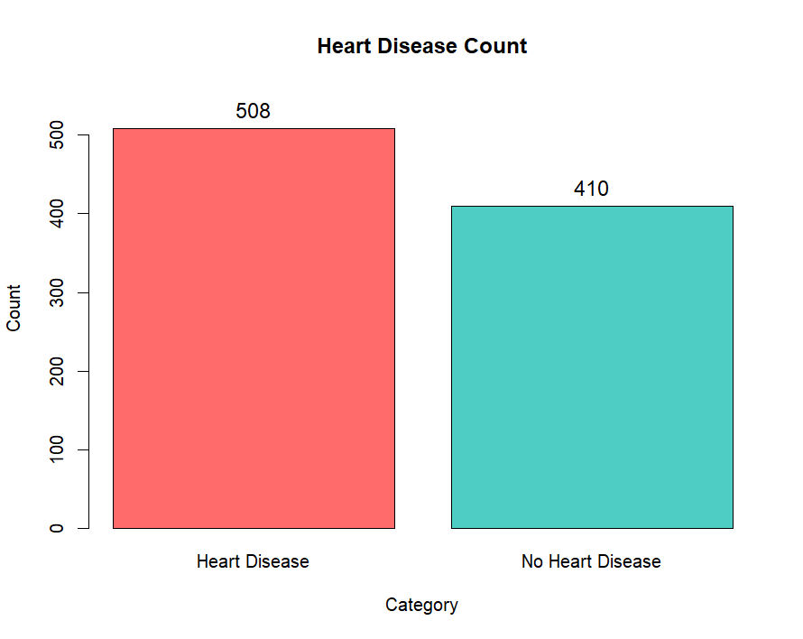
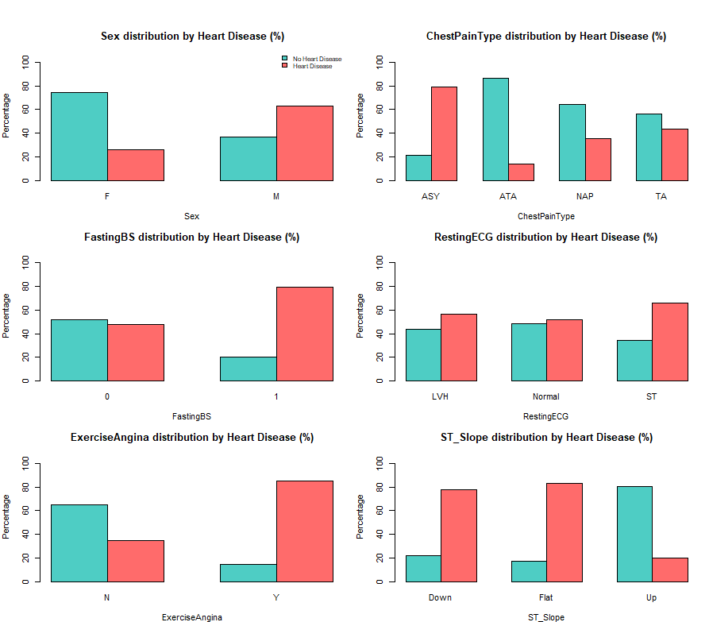
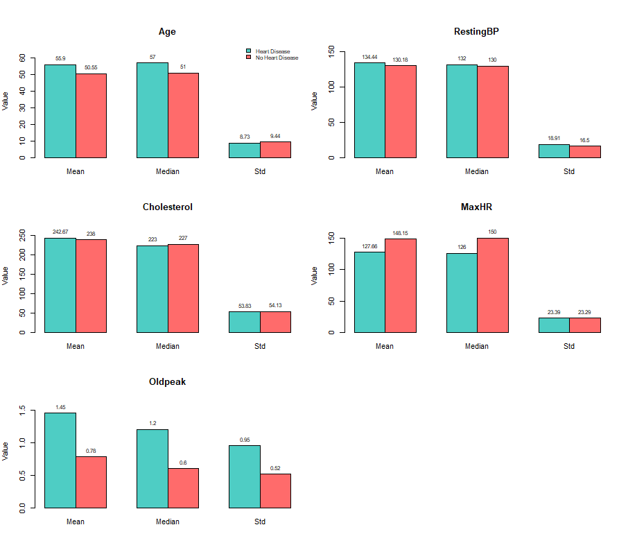
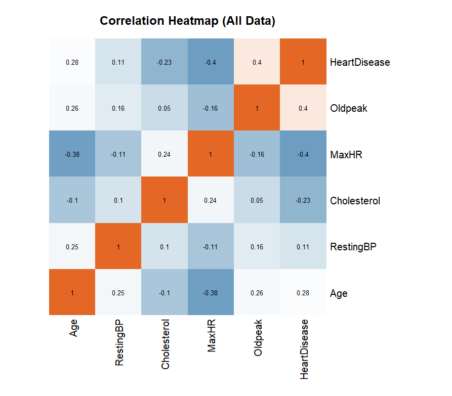
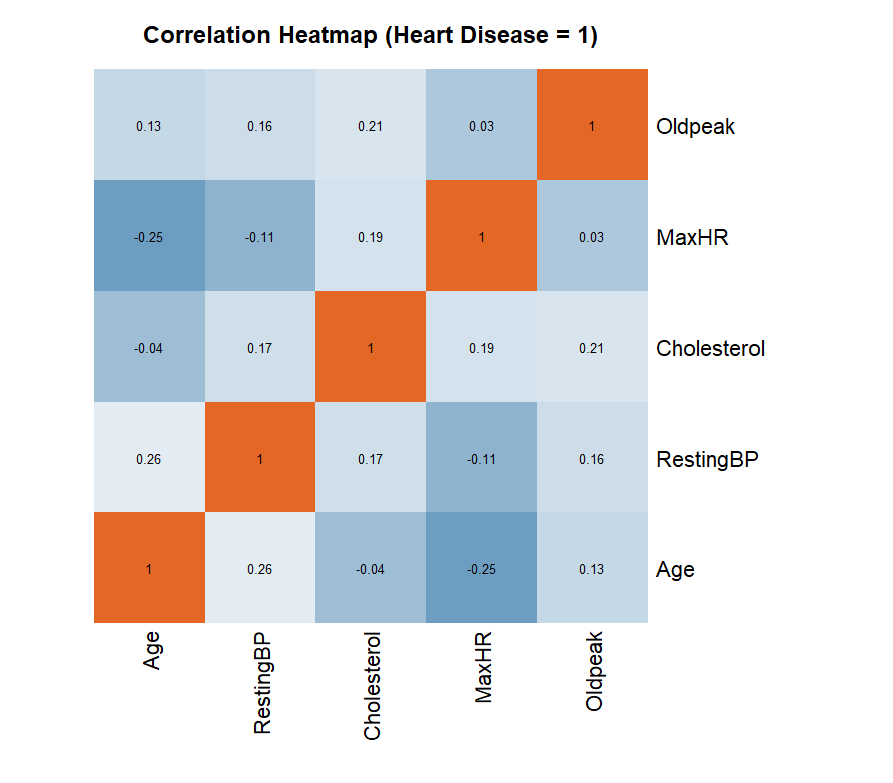
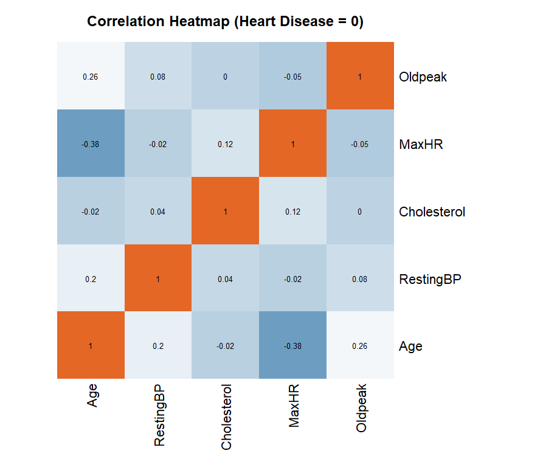
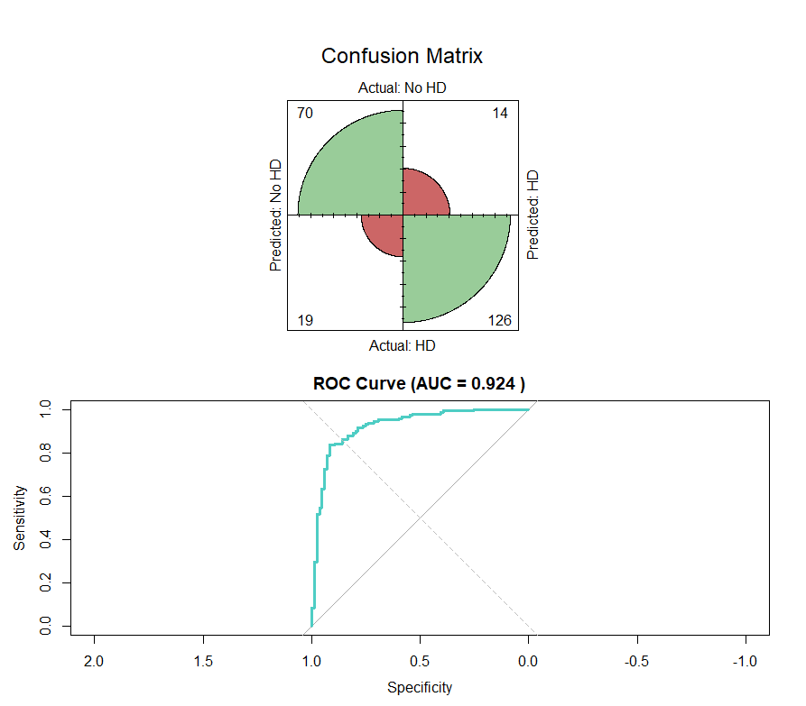
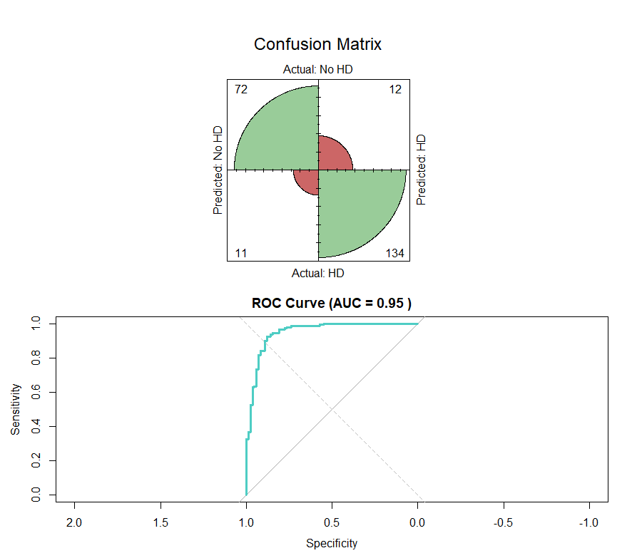

# Μέθοδοι Στατιστικής και Μηχανικής Μάθηση  
## 2η Εργασία

**Τμήμα:** Στατιστικής  
**Ίδρυμα:** Οικονομικό Πανεπιστήμιο Αθηνών  

**Διδάσκων:** [Δημήτρης Καρλής-Κωνσταντίνος Πανούσης]  
**Φοιτητής:** [Σωκράτης-Βησσαρίων Γιαννούτσος]  
**Αριθμός Μητρώου:** [3220028]  

---

## Θέμα – Περίληψη (Abstract)

Σκοπός της εργασίας είναι η ανάλυση δεδομένων και η εφαρμογή
μεθόδων Supervised Learning για την Classification ύπαρξης καρδιακής νόσου,
βάσει δημογραφικών και κλινικών χαρακτηριστικών ασθενών.

Χρησιμοποιείται ένα σύνολο δεδομένων με 918 παρατηρήσεις και 11 μεταβλητές εισόδου,
ενώ η μεταβλητή-στόχος είναι binary και υποδηλώνει αν ο ασθενής πάσχει ή όχι από καρδιακή ανεπάρκεια.
Αρχικά πραγματοποιείται διερευνητική ανάλυση δεδομένων (EDA), με έλεγχο ελλιπών τιμών,
ακραίων παρατηρήσεων και βασικών περιγραφικών στατιστικών τόσο στις συνεχείς όσο και στις κατηγορικές μεταβλητές, καθώς και οπτικοποίησητων σχέσεων μεταξύ των μεταβλητών.

Στη συνέχεια εφαρμόζονται και συγκρίνονται τρεις κατηγορίες αλγορίθμων ταξινόμησης:
Naive Bayes, μέθοδοι ensemble βασισμένες στο bagging, διάλεξα την χρήση του Random Forest και μέθοδοι
boosting, όπου διάλεξα την xGBoost. Η αξιολόγηση των μοντέλων γίνεται με χρήση κατάλληλων μετρικών,
όπως πίνακες σύγχυσης και καμπύλες ROC.

---

## Στόχος της Εργασίας

Ο βασικός στόχος της εργασίας είναι:
- η κατανόηση της συμπεριφοράς διαφορετικών μοντέλων μηχανικής μάθησης
- η σύγκριση της προγνωστικής τους ικανότητας στο πρόβλημα της καρδιακής νόσου
- η επιλογή του καταλληλότερου μοντέλου βάσει των αποτελεσμάτων αξιολόγησης

---

## (Α) Εξερεύνηση και καθαρισμός του συνόλου δεδομένων

Στο πρώτο στάδιο της εργασίας πραγματοποιείται εξερεύνηση και καθαρισμός του
συνόλου δεδομένων, με στόχο τη διασφάλιση της ποιότητας των δεδομένων προτού να συνεχίσουμε 
στην παρουσίαση βασικών στατιστικών των μεταβλητών, σχέσεις μεταξύ τους και ανάπτυξης μοντέλων πρόβλεψης.

Το σύνολο δεδομένων περιλαμβάνει 918 παρατηρήσεις και συνολικά 12 μεταβλητές,
εκ των οποίων οι 11 αποτελούν μεταβλητές εισόδου και μία τη μεταβλητή απόκρισης
**HeartDisease**, η οποία είναι δυαδική και δηλώνει την ύπαρξη (1) ή μη (0)
καρδιακής νόσου.

Αρχικά, το σύνολο δεδομένων χωρίστηκε σε:
- μεταβλητές εισόδου (X)
- μεταβλητή-απόκριση (y)

Στη συνέχεια, οι μεταβλητές εισόδου διαχωρίστηκαν σε:
- **ποσοτικές μεταβλητές** (Age, RestingBP, Cholesterol, MaxHR, Oldpeak)
- **κατηγορικές μεταβλητές** (Sex, ChestPainType, FastingBS, RestingECG,
  ExerciseAngina, ST_Slope)

Πραγματοποιήθηκε έλεγχος για ελλιπείς τιμές τόσο στις μεταβλητές εισόδου όσο
και στη μεταβλητή-στόχο. Από τον έλεγχο διαπιστώθηκε ότι δεν υπάρχουν ελλιπείς
τιμές στο σύνολο δεδομένων.

Στη συνέχεια εξετάστηκε η ύπαρξη ακραίων ή μη ρεαλιστικών τιμών στις ποσοτικές
μεταβλητές. Για τον εντοπισμό ακραίων τιμών χρησιμοποιήθηκε η μέθοδος του
ενδοτεταρτημοριακού εύρους (Interquartile Range – IQR).

Παράλληλα, εντοπίστηκαν μη αποδεκτές τιμές, όπως:
- μηδενικές τιμές
- αρνητικές τιμές

σε ποσοτικές μεταβλητές όπου αυτές δεν έχουν φυσική ερμηνεία ή είναι πρακτικά
αδύνατο να εμφανιστούν.
Για παράδειγμα, μεταβλητές όπως η **RestingBP** (αρτηριακή πίεση ηρεμίας),
η **Cholesterol** (επίπεδα χοληστερόλης) και η **MaxHR** (μέγιστη καρδιακή συχνότητα)
δεν μπορούν να λάβουν μηδενικές ή αρνητικές τιμές στην πράξη. Τέτοιες τιμές
πιθανότατα οφείλονται σε σφάλματα καταγραφής ή απουσία μέτρησης.

Οι παρατηρήσεις αυτές δεν αφαιρέθηκαν από το σύνολο δεδομένων, αλλά
αντικαταστάθηκαν με τη διάμεσο της αντίστοιχης μεταβλητής, ώστε να περιοριστεί
η επίδρασή τους χωρίς να αλλοιωθεί η συνολική δομή των δεδομένων.

Οι τιμές αυτές αντικαταστάθηκαν με τη διάμεσο της αντίστοιχης μεταβλητής,
ώστε να περιοριστεί η επίδρασή τους χωρίς να αφαιρεθούν παρατηρήσεις από το
σύνολο δεδομένων.

Τέλος, οι κατηγορικές μεταβλητές μετατράπηκαν σε αριθμητική μορφή μέσω
κωδικοποίησης, ώστε το σύνολο δεδομένων να είναι σε κατάλληλη μορφή για περαιτέρω μελετη.

## (Β) Οπτικοποίηση και ανάλυση μεταβλητών

Στο δεύτερο μέρος της εργασίας παρουσιάζονται και αναλύονται τα διαγράμματα που
προκύπτουν από τη διερευνητική ανάλυση δεδομένων. Η ανάλυση περιλαμβάνει την
κατανομή της μεταβλητής-στόχου, καθώς και την εξέταση κατηγορικών και ποσοτικών
μεταβλητών και των μεταξύ τους συσχετίσεων.

---

### (Β.1) Κατανομή της μεταβλητής-στόχου

Το παρακάτω διάγραμμα παρουσιάζει την κατανομή της μεταβλητής-στόχου
**HeartDisease** στο σύνολο δεδομένων.

Παρατηρείται ότι το σύνολο δεδομένων είναι σχετικά ισορροπημένο, με ελαφρώς
μεγαλύτερο αριθμό παρατηρήσεων που αντιστοιχούν σε ασθενείς με καρδιακή νόσο.
Η απουσία έντονης ανισορροπίας μειώνει τον κίνδυνο μεροληψίας κατά την εκπαίδευση
των μοντέλων, ενώ η κατανομή αυτή λαμβάνεται υπόψη και κατά τον διαχωρισμό των
δεδομένων σε training και test set.

---

### (Β.2) Κατηγορικές μεταβλητές και σχέση με την καρδιακή νόσο

Τα barcharts παρουσιάζουν τις ποσοστιαίες κατανομές των κατηγορικών
μεταβλητών ως προς τη μεταβλητή-στόχο **HeartDisease**.

**Φύλο (Sex):**  
Παρατηρείται ότι στους άνδρες το ποσοστό εμφάνισης καρδιακής νόσου είναι σημαντικά
υψηλότερο σε σύγκριση με τις γυναίκες. Αντίθετα, στις γυναίκες υπερισχύει η απουσία
καρδιακής νόσου.

**Τύπος Πόνου στο Στήθος (ChestPainType):**  
Ο τύπος **ASY (Asymptomatic)** εμφανίζει υψηλό ποσοστό καρδιακής νόσου, γεγονός
που τον καθιστά ιδιαίτερα ενδεικτικό. Αντίθετα, οι τύποι **ATA** και **NAP**
σχετίζονται κυρίως με απουσία νόσου.

**Fasting Blood Sugar (FastingBS):**  
Για τιμή **FastingBS = 1**, παρατηρείται σαφώς αυξημένο ποσοστό καρδιακής νόσου,
σε σχέση με την τιμή 0, γεγονός που υποδηλώνει συσχέτιση με τη μεταβλητή-στόχο.

**Resting ECG:**  
Η κατηγορία **ST** παρουσιάζει υψηλότερα ποσοστά καρδιακής νόσου σε σύγκριση με
τις κατηγορίες **Normal** και **LVH**.

**Exercise-Induced Angina:**  
Η παρουσία στηθάγχης κατά την άσκηση (**Y**) σχετίζεται έντονα με καρδιακή νόσο,
ενώ η απουσία της (**N**) συνδέεται κυρίως με υγιείς ασθενείς.

**ST_Slope:**  
Οι κατηγορίες **Down** και **Flat** εμφανίζουν αυξημένα ποσοστά καρδιακής νόσου,
ενώ η κατηγορία **Up** σχετίζεται κυρίως με απουσία νόσου.

Συνολικά, οι κατηγορικές μεταβλητές παρουσιάζουν ξεκάθαρα διαφοροποιημένες
κατανομές μεταξύ των δύο κλάσεων και θεωρούνται σημαντικές για τη μοντελοποίηση.

---

### (Β.3) Ποσοτικές μεταβλητές – Περιγραφικά στατιστικά

Για τις ποσοτικές μεταβλητές υπολογίστηκαν ο μέσος όρος, η διάμεσος και η τυπική
απόκλιση, ξεχωριστά για ασθενείς με και χωρίς καρδιακή νόσο.

**Age:**  
Οι ασθενείς με καρδιακή νόσο εμφανίζουν υψηλότερη μέση ηλικία, γεγονός που
συμφωνεί με την κλινική εμπειρία.

**RestingBP και Cholesterol:**  
Οι διαφορές μεταξύ των δύο ομάδων είναι ηπιότερες, υποδηλώνοντας ότι οι
μεταβλητές αυτές από μόνες τους δεν διαφοροποιούν έντονα τις κλάσεις.

**MaxHR:**  
Η μέγιστη καρδιακή συχνότητα είναι αισθητά χαμηλότερη στους ασθενείς με
καρδιακή νόσο, γεγονός που την καθιστά ιδιαίτερα χρήσιμη μεταβλητή.

**Oldpeak:**  
Παρουσιάζει σημαντικά υψηλότερες τιμές στους ασθενείς με καρδιακή νόσο,
αναδεικνύοντάς την ως μία από τις πιο διακριτικές ποσοτικές μεταβλητές.

Οι παραπάνω παρατηρήσεις δείχνουν ότι ορισμένες ποσοτικές μεταβλητές διαθέτουν
ισχυρή προγνωστική πληροφορία.

---

### (Β.4) Ανάλυση συσχέτισης ποσοτικών μεταβλητών

Υπολογίστηκαν συντελεστές συσχέτισης Pearson μεταξύ των ποσοτικών μεταβλητών και
παρουσιάστηκαν μέσω heatmaps, με στόχο τη διερεύνηση γραμμικών σχέσεων και τον
εντοπισμό πιθανών ενδείξεων πολυσυγγραμμικότητας.

**Συνολικό σύνολο δεδομένων:**  
Από το heatmap του πλήρους συνόλου δεδομένων παρατηρείται ότι η μεταβλητή
**HeartDisease** εμφανίζει:
- θετική συσχέτιση με την **Age**
- ισχυρότερη θετική συσχέτιση με το **Oldpeak**
- αρνητική συσχέτιση με τη **MaxHR**

Παράλληλα, δεν παρατηρούνται πολύ υψηλές συσχετίσεις μεταξύ των ποσοτικών
μεταβλητών, γεγονός που υποδηλώνει περιορισμένο κίνδυνο πολυσυγγραμμικότητας.

**Ασθενείς με καρδιακή νόσο (HeartDisease = 1):**  
Οι συσχετίσεις είναι γενικά ασθενείς, γεγονός που υποδηλώνει μεγαλύτερη
ετερογένεια στα χαρακτηριστικά των ασθενών.

**Ασθενείς χωρίς καρδιακή νόσο (HeartDisease = 0):**  
Παρατηρούνται ελαφρώς πιο σταθερά μοτίβα συσχέτισης, χωρίς έντονη
πολυσυγγραμμικότητα.

Συνολικά, η ανάλυση συσχέτισης δείχνει ότι οι ποσοτικές μεταβλητές παρέχουν
συμπληρωματική πληροφορία, χωρίς να παρουσιάζουν έντονες εξαρτήσεις μεταξύ τους,
γεγονός που ευνοεί την εφαρμογή των μοντέλων μηχανικής μάθησης.

## (Γ) Προεπεξεργασία δεδομένων και δομή κλάσεων

Στο στάδιο αυτό υλοποιήθηκαν δύο βασικές κλάσεις με στόχο την οργάνωση της
προεπεξεργασίας των δεδομένων και της αξιολόγησης των μοντέλων μηχανικής μάθησης:
η κλάση **DataPreprocessor** και η κλάση **ModelEvaluator**.  
Η χρήση κλάσεων επιτρέπει καθαρότερο κώδικα, επαναχρησιμοποίηση λειτουργιών και
ενιαία διαδικασία αξιολόγησης για όλα τα μοντέλα.

---

### (Γ.1) Κλάση DataPreprocessor

Η κλάση **DataPreprocessor** είναι υπεύθυνη για:
- τον διαχωρισμό του συνόλου δεδομένων σε σύνολα εκπαίδευσης και ελέγχου
- την τυποποίηση (scaling) των ποσοτικών μεταβλητών με βάση τον τύπο που θα δώσουμε σαν είσοδο (π.χ. Min-Max, Standard)
- τη διασφάλιση ότι δεν υπάρχει διαρροή πληροφορίας (data leakage)

Ο διαχωρισμός των δεδομένων πραγματοποιείται με stratified sampling, μέσω της
συνάρτησης `createDataPartition()` του πακέτου `caret`, ώστε να διατηρείται η
αναλογία των κλάσεων της μεταβλητής-στόχου τόσο στο training όσο και στο test set.
Με τον τρόπο αυτό αποφεύγονται στρεβλώσεις στην αξιολόγηση των μοντέλων.

Για τις ποσοτικές μεταβλητές εφαρμόζεται **τυποποίηση (standardization)**, κατά την
οποία αφαιρείται ο μέσος όρος και διαιρείται με την τυπική απόκλιση. Τα στατιστικά
αυτά υπολογίζονται αποκλειστικά στο training set και στη συνέχεια εφαρμόζονται στο
test set, ώστε να αποφευχθεί η χρήση πληροφορίας από τα δεδομένα ελέγχου κατά την
εκπαίδευση των μοντέλων.

Η κλάση επιστρέφει τα τελικά σύνολα:
- X_train, y_train για την εκπαίδευση
- X_test, y_test για την αξιολόγηση

---

### (Γ.2) Κλάση ModelEvaluator

Η κλάση **ModelEvaluator** είναι υπεύθυνη για την εκπαίδευση, την πρόβλεψη και την
αξιολόγηση των μοντέλων μηχανικής μάθησης με ενιαίο και συγκρίσιμο τρόπο.

Συγκεκριμένα, η κλάση:
- λαμβάνει ως είσοδο τα σύνολα εκπαίδευσης και ελέγχου (X_train, y_train, X_test, y_test)
- εκπαιδεύει το εκάστοτε μοντέλο ταξινόμησης
- παράγει προβλέψεις κλάσης (hard labels)
- παράγει προβλέψεις πιθανοτήτων (soft labels), απαραίτητες για την καμπύλη ROC
- υπολογίζει πίνακα σύγχυσης (confusion matrix)
- υπολογίζει βασικές μετρικές απόδοσης μέσω της συνάρτησης `confusionMatrix`
- παράγει καμπύλη ROC και υπολογίζει την τιμή AUC
- οπτικοποιεί τα αποτελέσματα (confusion matrix και ROC curve)

Η υλοποίηση της κλάσης περιλαμβάνει εσωτερικό έλεγχο του τύπου του μοντέλου
(Naive Bayes, Random Forest, XGBoost), ώστε να γίνεται σωστός χειρισμός των
προβλέψεων πιθανοτήτων για κάθε αλγόριθμο.

Με τη χρήση της ίδιας κλάσης για όλα τα μοντέλα, εξασφαλίζεται ότι:
- η εκπαίδευση
- η διαδικασία πρόβλεψης
- και η αξιολόγηση

πραγματοποιούνται με απολύτως ενιαίο τρόπο, επιτρέποντας άμεση και δίκαιη
σύγκριση των αποτελεσμάτων μεταξύ των διαφορετικών αλγορίθμων.

---

Συνολικά, η χρήση των κλάσεων **DataPreprocessor** και **ModelEvaluator**
συμβάλλει στη δομημένη ανάλυση, στη μείωση λαθών και στη διαφανή σύγκριση των
μοντέλων που ακολουθούν.

## (Δ) Παρουσίαση μοντέλων και αποτελεσμάτων

Στο παρόν μέρος παρουσιάζονται τα μοντέλα μηχανικής μάθησης που εφαρμόστηκαν,
καθώς και τα αποτελέσματά τους στο σύνολο ελέγχου. Η παρουσίαση γίνεται με τη
σειρά υλοποίησης στον κώδικα, χωρίς συγκριτική αξιολόγηση σε αυτό το στάδιο.

---

### (Δ.1) Naive Bayes

Το πρώτο μοντέλο που εφαρμόστηκε είναι ο ταξινομητής **Naive Bayes**, ο οποίος
αποτελεί ένα απλό πιθανοτικό μοντέλο βασισμένο στην υπόθεση ανεξαρτησίας των
χαρακτηριστικών.

Το μοντέλο εκπαιδεύτηκε στο training set και αξιολογήθηκε στο test set μέσω:
- πίνακα σύγχυσης (confusion matrix)
- καμπύλης ROC και της αντίστοιχης τιμής AUC

Από τον πίνακα σύγχυσης παρατηρείται ότι το μοντέλο ταξινομεί σωστά μεγάλο αριθμό
παρατηρήσεων και για τις δύο κλάσεις, με περιορισμένο αριθμό λανθασμένων
προβλέψεων.

Η καμπύλη ROC εμφανίζει καλή απόδοση, με τιμή **AUC = 0.924**, γεγονός που δείχνει
ότι το μοντέλο έχει ικανοποιητική ικανότητα διάκρισης μεταξύ ασθενών με και χωρίς
καρδιακή νόσο.

Σύμφωνα με το classification report, το μοντέλο επιτυγχάνει συνολική ακρίβεια
**Accuracy = 0.856**, γεγονός που δείχνει ικανοποιητική γενική απόδοση στο σύνολο
ελέγχου.

Η **Precision = 0.900** υποδηλώνει ότι όταν το μοντέλο προβλέπει καρδιακή νόσο,
οι προβλέψεις του είναι σε μεγάλο βαθμό σωστές. Παράλληλα, η
**Recall (Sensitivity) = 0.869** δείχνει ότι το μοντέλο ανιχνεύει αποτελεσματικά
ένα μεγάλο ποσοστό των πραγματικών περιστατικών καρδιακής νόσου.

Ο δείκτης **F1-score = 0.884** επιβεβαιώνει την καλή ισορροπία μεταξύ precision
και recall.

Η **Specificity = 0.833** δείχνει ικανοποιητική αναγνώριση των υγιών ατόμων,
ενώ η τιμή **Cohen’s Kappa = 0.694** υποδηλώνει ουσιαστική συμφωνία πέρα από
την τυχαία ταξινόμηση. Η τιμή **AUC = 0.924** επιβεβαιώνει την καλή διακριτική
ικανότητα του μοντέλου.

---

### (Δ.2) Random Forest

Στη συνέχεια εφαρμόστηκε το μοντέλο **Random Forest**, το οποίο αποτελεί μέθοδο
ensemble βασισμένη στο bagging και στη χρήση πολλαπλών δέντρων απόφασης.

Το μοντέλο εκπαιδεύτηκε με μεγάλο αριθμό δέντρων και αξιολογήθηκε στο ίδιο test set,
χρησιμοποιώντας την ίδια διαδικασία αξιολόγησης.

Ο πίνακας σύγχυσης δείχνει βελτιωμένη ταξινόμηση και για τις δύο κλάσεις, με λιγότερα
σφάλματα σε σχέση με το προηγούμενο μοντέλο.

Η καμπύλη ROC παρουσιάζει πολύ υψηλή απόδοση, με τιμή **AUC = 0.949**, υποδηλώνοντας
ισχυρή ικανότητα διάκρισης μεταξύ των δύο κλάσεων.

Το classification report δείχνει ότι το μοντέλο επιτυγχάνει υψηλή συνολική
ακρίβεια **Accuracy = 0.908**, γεγονός που υποδηλώνει αξιόπιστη συνολική
ταξινόμηση.

Η **Precision = 0.925** δείχνει ότι οι προβλέψεις καρδιακής νόσου είναι ιδιαίτερα
ακριβείς, ενώ η **Recall (Sensitivity) = 0.931** υποδηλώνει ότι το μοντέλο
ανιχνεύει με μεγάλη επιτυχία τα πραγματικά θετικά περιστατικά.

Ο δείκτης **F1-score = 0.928** καταδεικνύει πολύ καλή ισορροπία μεταξύ precision
και recall.

Η **Specificity = 0.869** παραμένει σε υψηλό επίπεδο, ενώ η τιμή
**Cohen’s Kappa = 0.802** δείχνει ισχυρή συμφωνία μεταξύ προβλέψεων και
πραγματικών ετικετών. Η τιμή **AUC = 0.949** επιβεβαιώνει την πολύ καλή
διακριτική ικανότητα του μοντέλου.

---

### (Δ.3) XGBoost

Τέλος, εφαρμόστηκε το μοντέλο **XGBoost**, το οποίο ανήκει στις μεθόδους boosting
και βασίζεται στη διαδοχική εκπαίδευση ασθενών ταξινομητών, δίνοντας έμφαση στη
διόρθωση προηγούμενων σφαλμάτων.

Το μοντέλο εκπαιδεύτηκε με συγκεκριμένες υπερπαραμέτρους, όπως ο ρυθμός μάθησης
(learning rate) και ο αριθμός επαναλήψεων (nrounds), και αξιολογήθηκε στο test set.

Ο πίνακας σύγχυσης δείχνει υψηλή ακρίβεια ταξινόμησης, με πολύ περιορισμένο αριθμό
λανθασμένων προβλέψεων.

Η καμπύλη ROC εμφανίζει εξαιρετική απόδοση, με τιμή **AUC = 0.950**, γεγονός που
υποδηλώνει πολύ ισχυρή διακριτική ικανότητα του μοντέλου.

Το μοντέλο XGBoost παρουσιάζει πολύ υψηλή συνολική απόδοση, με
**Accuracy = 0.913**, γεγονός που υποδηλώνει σταθερή και αξιόπιστη ταξινόμηση.

Η **Precision = 0.925** δείχνει ότι οι προβλέψεις καρδιακής νόσου είναι ιδιαίτερα
ακριβείς, ενώ η **Recall (Sensitivity) = 0.938** καταδεικνύει εξαιρετική ικανότητα
εντοπισμού των πραγματικών περιστατικών καρδιακής νόσου.

Ο δείκτης **F1-score = 0.932** επιβεβαιώνει την ισορροπία μεταξύ precision και
recall και την υψηλή ποιότητα της ταξινόμησης.

Η **Specificity = 0.869** παραμένει υψηλή, ενώ η τιμή **Cohen’s Kappa = 0.811**
δείχνει ισχυρή συμφωνία πέρα από την τυχαία ταξινόμηση. Η τιμή
**AUC = 0.950** επιβεβαιώνει την εξαιρετική διακριτική ικανότητα του μοντέλου.

## (Ε) Συγκριτική αξιολόγηση μοντέλων

Στο παρόν μέρος πραγματοποιείται συγκριτική αξιολόγηση των μοντέλων μηχανικής
μάθησης που εφαρμόστηκαν, με βάση τις μετρικές απόδοσης που προέκυψαν στο σύνολο
ελέγχου. Η σύγκριση βασίζεται κυρίως στις μετρικές Accuracy, Precision, Recall και
F1-score, ενώ λαμβάνονται υπόψη και συμπληρωματικές μετρικές, όπως το AUC και ο
δείκτης Cohen’s Kappa.

---

### (Ε.1) Συγκριτική παρουσίαση βασικών μετρικών

Το μοντέλο **Naive Bayes** παρουσιάζει ικανοποιητική συνολική απόδοση, με καλές
τιμές precision και recall, γεγονός που δείχνει ότι μπορεί να διαχωρίσει σε
σημαντικό βαθμό τις δύο κλάσεις. Ωστόσο, η συνολική του ακρίβεια και η ισορροπία
μεταξύ precision και recall είναι χαμηλότερες σε σχέση με τα πιο σύνθετα μοντέλα.

Το μοντέλο **Random Forest** εμφανίζει σημαντική βελτίωση σε όλες τις βασικές
μετρικές. Οι υψηλές τιμές accuracy, recall και F1-score δείχνουν ότι το μοντέλο
καταφέρνει να εντοπίζει με μεγάλη επιτυχία τα περιστατικά καρδιακής νόσου, χωρίς
να θυσιάζει την ακρίβεια στις προβλέψεις της αρνητικής κλάσης.

Το μοντέλο **XGBoost** παρουσιάζει την υψηλότερη συνολική απόδοση, με τις καλύτερες
ή ισοδύναμα καλύτερες τιμές σε accuracy, recall και F1-score. Η αυξημένη τιμή
recall υποδηλώνει εξαιρετική ικανότητα ανίχνευσης καρδιακής νόσου, ενώ το υψηλό
precision δείχνει περιορισμένο αριθμό ψευδώς θετικών προβλέψεων.

---

### (Ε.2) Ανάλυση Precision–Recall και F1-score

Η μετρική **Precision** είναι κρίσιμη όταν το κόστος των ψευδώς θετικών προβλέψεων
είναι υψηλό, ενώ η **Recall** είναι ιδιαίτερα σημαντική σε ιατρικές εφαρμογές,
όπου η μη ανίχνευση πραγματικών περιστατικών (false negatives) μπορεί να έχει
σοβαρές συνέπειες.

Στο πλαίσιο αυτό, τα μοντέλα Random Forest και XGBoost παρουσιάζουν σαφώς ανώτερη
ισορροπία μεταξύ precision και recall, όπως αποτυπώνεται και στις υψηλές τιμές
του **F1-score**. Αντίθετα, το Naive Bayes εμφανίζει χαμηλότερο F1-score,
υποδεικνύοντας λιγότερο αποτελεσματική ισορροπία μεταξύ των δύο μετρικών.

---

### (Ε.3) Συγκριτική αξιολόγηση AUC και Cohen’s Kappa

Η καμπύλη ROC και η αντίστοιχη τιμή **AUC** παρέχουν μια συνολική εικόνα της
διακριτικής ικανότητας των μοντέλων, ανεξάρτητα από το κατώφλι απόφασης.
Παρατηρείται ότι όλα τα μοντέλα παρουσιάζουν υψηλές τιμές AUC, με το XGBoost και
το Random Forest να υπερέχουν.

Ο δείκτης **Cohen’s Kappa**, ο οποίος μετρά τη συμφωνία μεταξύ προβλέψεων και
πραγματικών ετικετών πέρα από την τυχαία ταξινόμηση, επιβεβαιώνει τα παραπάνω
ευρήματα. Τα μοντέλα ensemble παρουσιάζουν υψηλότερες τιμές Kappa, γεγονός που
υποδηλώνει πιο αξιόπιστη και σταθερή συμπεριφορά.

---

### (Ε.4) Συνολική αποτίμηση

Συνολικά, η συγκριτική ανάλυση δείχνει ότι τα μοντέλα ensemble υπερέχουν έναντι
του απλού πιθανοτικού μοντέλου Naive Bayes. Το Random Forest και το XGBoost
επιτυγχάνουν υψηλότερη ακρίβεια, καλύτερη ισορροπία μεταξύ precision και recall,
καθώς και ανώτερη διακριτική ικανότητα.

Με βάση τα παραπάνω αποτελέσματα, το XGBoost εμφανίζεται ως το πιο αποδοτικό
μοντέλο στο συγκεκριμένο πρόβλημα ταξινόμησης, χωρίς ωστόσο να παραβλέπεται η
απλότητα και η ερμηνευσιμότητα του Naive Bayes, καθώς και η σταθερότητα του
Random Forest.

## (ΣΤ) Συμπεράσματα

Στην παρούσα εργασία πραγματοποιήθηκε διερευνητική ανάλυση δεδομένων και εφαρμόστηκαν
διαφορετικά μοντέλα supervised learning για την πρόβλεψη της ύπαρξης
καρδιακής νόσου, χρησιμοποιώντας δημογραφικά και κλινικά χαρακτηριστικά ασθενών.

Η διερευνητική ανάλυση ανέδειξε σαφείς διαφοροποιήσεις μεταξύ ασθενών με και χωρίς
καρδιακή νόσο, τόσο σε κατηγορικές όσο και σε ποσοτικές μεταβλητές. Μεταβλητές όπως
η ηλικία, η μέγιστη καρδιακή συχνότητα (MaxHR), το Oldpeak και ο τύπος πόνου στο
στήθος φάνηκαν να διαθέτουν αυξημένη προγνωστική αξία, ενώ δεν παρατηρήθηκε έντονη
πολυσυγγραμμικότητα μεταξύ των ποσοτικών χαρακτηριστικών.

Από τη μοντελοποίηση προέκυψε ότι όλα τα εξεταζόμενα μοντέλα παρουσιάζουν καλή
ικανότητα ταξινόμησης, με υψηλές τιμές accuracy, precision, recall και F1-score.
Το Naive Bayes λειτούργησε ως ένα αξιόπιστο και απλό baseline μοντέλο, επιτυγχάνοντας
ικανοποιητική απόδοση παρά την ισχυρή υπόθεση ανεξαρτησίας των χαρακτηριστικών.

Τα μοντέλα ensemble, και ειδικότερα τα Random Forest και XGBoost, παρουσίασαν
ανώτερη συνολική απόδοση. Οι υψηλές τιμές recall και F1-score υποδηλώνουν αυξημένη
ικανότητα εντοπισμού περιστατικών καρδιακής νόσου, στοιχείο ιδιαίτερα σημαντικό σε
εφαρμογές ιατρικής πρόβλεψης. Παράλληλα, οι υψηλές τιμές AUC και Cohen’s Kappa
επιβεβαιώνουν τη σταθερότητα και τη διακριτική ικανότητα των μοντέλων αυτών.

Συνολικά, τα αποτελέσματα δείχνουν ότι η χρήση πιο σύνθετων μεθόδων ensemble
βελτιώνει σημαντικά την προγνωστική απόδοση στο συγκεκριμένο πρόβλημα, με το
XGBoost να εμφανίζεται ως το πιο αποδοτικό μοντέλο στο πλαίσιο της παρούσας
ανάλυσης.
